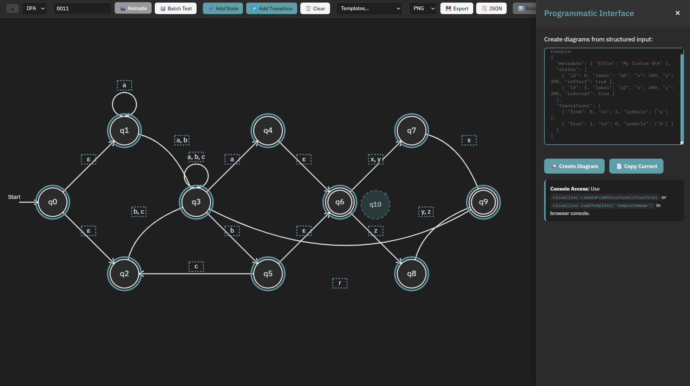

# State Diagram Visualizer


My tool for creating and visualizing finite automata (DFA/NFA) with animation support. Built for people who want to make DFAs/NFAs/etc

## Setup

1. Clone or download this repository
2. Open `index.html` 
That's it.

For local development with live reload:
```bash
# Using Python 3
python -m http.server 8000

# Using Node.js
npx http-server
```

Then visit `http://localhost:8000`

## Hotkeys

### Basic Operations
- **S** - Create state at mouse position
- **Ctrl+S** - Toggle "Add State" mode
- **Ctrl+T** - Toggle "Add Transition" mode
- **Ctrl+Enter** - Start animation
- **Enter** (in input field) - Start animation
- **Escape** - Clear selection or cancel current mode

### Selection and Editing
- **Ctrl+A** - Select all elements
- **Ctrl+Click** - Add/remove from selection
- **Delete/Backspace** - Delete selected elements
- **Double-click state** - Rename state inline
- **Shift+click state** - Toggle accepting status
- **Alt+click state** - Delete state

### View Controls
- **Mouse wheel** - Zoom in/out at cursor
- **+** - Zoom in
- **-** - Zoom out
- **0** - Reset zoom to 100%
- **F** - Fit diagram to view

### Undo/Redo
- **Ctrl+Z** - Undo
- **Ctrl+Y** or **Ctrl+Shift+Z** - Redo

### Advanced
- **Drag on canvas** - Box select multiple elements
- **Ctrl+click two states** - Quick transition creation
- **Right-click state** - Context menu for state properties
- **Right-click selection** - Bulk operations and zoom to selection

## JSON Structure Format

The visualizer accepts JSON input for programmatic diagram creation. Access this through the "⚡ Code" panel or browser console.

### Basic Structure

```json
{
  "metadata": {
    "title": "Diagram Name",
    "description": "Optional description"
  },
  "states": [
    {
      "id": 0,
      "label": "q0",
      "x": 200,
      "y": 300,
      "isStart": true,
      "isAccept": false
    }
  ],
  "transitions": [
    {
      "from": 0,
      "to": 1,
      "symbols": ["a", "b"],
      "curved": false
    }
  ]
}
```

### Field Reference

#### States Array
| Field | Type | Required | Default | Description |
|-------|------|----------|---------|-------------|
| `id` | number | Yes | - | Unique state identifier |
| `label` | string | No | `"q{id}"` | Display name |
| `x`, `y` | number | No | Auto-positioned | Coordinates in pixels |
| `isStart` | boolean | No | `false` | Start state flag |
| `isAccept` | boolean | No | `false` | Accepting state flag |

#### Transitions Array
| Field | Type | Required | Default | Description |
|-------|------|----------|---------|-------------|
| `from` | number | Yes | - | Source state ID |
| `to` | number | Yes | - | Target state ID |
| `symbols` | array/string | No | `["a"]` | Transition symbols |
| `curved` | boolean | No | Auto-calculated | Force curved transition |

### Examples

#### DFA: Strings ending with "ab"
```json
{
  "metadata": {
    "title": "Strings ending with 'ab'"
  },
  "states": [
    { "id": 0, "label": "q0", "x": 200, "y": 300, "isStart": true },
    { "id": 1, "label": "q1", "x": 450, "y": 300 },
    { "id": 2, "label": "q2", "x": 700, "y": 300, "isAccept": true }
  ],
  "transitions": [
    { "from": 0, "to": 0, "symbols": ["b"] },
    { "from": 0, "to": 1, "symbols": ["a"] },
    { "from": 1, "to": 1, "symbols": ["a"] },
    { "from": 1, "to": 2, "symbols": ["b"] },
    { "from": 2, "to": 1, "symbols": ["a"] },
    { "from": 2, "to": 0, "symbols": ["b"] }
  ]
}
```

#### NFA with ε-transitions
```json
{
  "metadata": {
    "title": "NFA with epsilon transitions"
  },
  "states": [
    { "id": 0, "label": "q0", "x": 200, "y": 300, "isStart": true },
    { "id": 1, "label": "q1", "x": 400, "y": 200 },
    { "id": 2, "label": "q2", "x": 400, "y": 400 },
    { "id": 3, "label": "q3", "x": 600, "y": 300, "isAccept": true }
  ],
  "transitions": [
    { "from": 0, "to": 1, "symbols": ["ε"] },
    { "from": 0, "to": 2, "symbols": ["ε"] },
    { "from": 1, "to": 3, "symbols": ["a"] },
    { "from": 2, "to": 3, "symbols": ["b"] }
  ]
}
```

### Programmatic API

#### Browser Console
```javascript
// Create from JSON structure
visualizer.createFromStructure(jsonObject);

// Load predefined template
visualizer.loadTemplate("endsWithAB");

// Export current diagram
const structure = visualizer.exportStructure();
```

## Customization

### Animation Speed
Modify in `stateVisualizer.js`:
```javascript
this.animationSpeed = 1000; // milliseconds per step
```

### Canvas Size
Adjust in `index.html`:
```html
<canvas id="diagram-canvas" width="1400" height="800"></canvas>
```